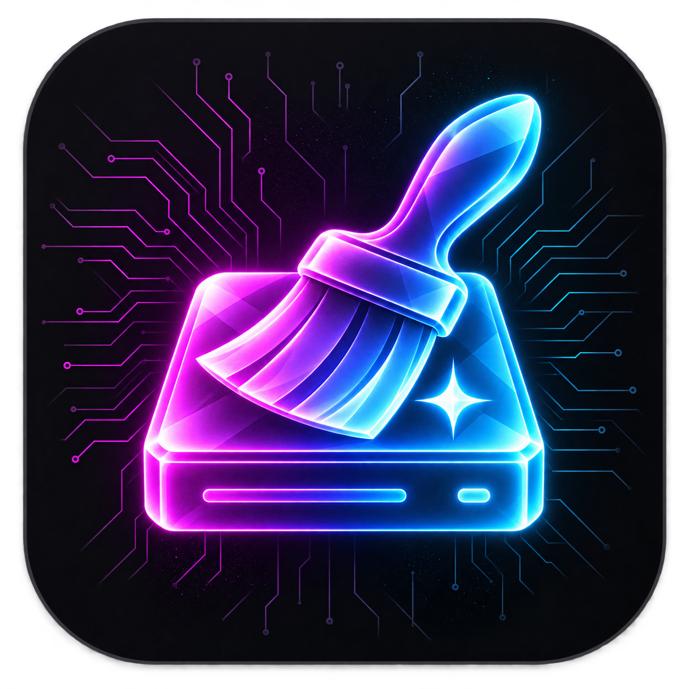

<p align="center"></p>

# OxyMac Cleaner

Native, local-first Mac cleanup and developer workspace inspection. **Free and open source.**

[Download the Apple Silicon preview](https://github.com/Datastore24Kirill/OxyMacCleaner/releases) · [Техническое задание](docs/SPEC-RU.md) · [Implementation status](docs/STATUS.md) · [Privacy](docs/PRIVACY.md)

## 0.1.4 Preview — implemented

- Native SwiftUI app for macOS 14+ on Apple Silicon, Russian/English UI, light/dark/system appearance.
- Startup disk selected by default, mounted local-volume selection and optional folder selection, cancellable scan, largest files and aggregated folder sizes, archive filtering and Finder reveal.
- Exact duplicate detection using size, SHA-256 and byte comparison; hard links and symlinks are handled conservatively.
- Individual-file quarantine, integrity-checked restoration, destination conflict protection and separately confirmed permanent deletion.
- Five-day quarantine reminder support (notifications require user permission).
- Xcode data inspection and read-only simulator inventory. No simulator/system-folder deletion.
- Catalog of 11 agent discovery hints. Import **one inactive session** as UTF-8 TXT/MD/JSON/JSONL; no mutation of agent databases.
- Verified history backup and local Ollama handoff generation in chunks, with an editable result, copy and Markdown export.
- Ollama installer assistant: official GitHub release, SHA-256 validation, code signature and Gatekeeper assessment. Reuses existing installations.
- Local model download progress/cancellation; no automatic cloud fallback. Model metadata must identify a local GGUF model.

This is an early implementation milestone, **not completion of the version-one specification**. Direct agent-history adapters, safe folder quarantine, advanced Xcode archive metadata, disk treemap and automatic updates/rollback remain planned. Context generation has protocol tests; its semantic quality has not yet been certified on real histories. Original histories are retained.

## Install

Download `OxyMacCleaner-0.1.4-macOS-arm64.zip`, extract the app and move it to Applications. No Python, Swift or Xcode installation is needed to run it. Verify the archive against `SHA256SUMS.txt` if desired.

The preview is ad-hoc signed, not Developer ID signed or notarized. macOS may block opening it. Do not disable Gatekeeper or SIP. Signing remains an open distribution task.

## Safe first use

1. Choose a disk (the startup disk is selected by default) or use the optional folder picker for a small test. Nothing is moved automatically.
2. Review files and duplicates; keep at least one copy per duplicate group.
3. Moving a file into quarantine **does not free its disk space**. Restore first to verify the workflow on a disposable file.
4. Project files inside Git repositories, package internals, agent storage, credentials and system paths are excluded from cleanup in this preview. Folder cleanup and cross-volume quarantine are unavailable.
5. To prepare an agent handoff, import an exported inactive session, configure a local model, review the result and paste it into a new chat. Existing chats are not rewritten.

APFS clones/snapshots mean logical file sizes are not a guarantee of reclaimable storage. Large scans currently retain file metadata in memory. Only the first 2,000 filtered files are rendered; narrow the search to access more results.

## Build and test

Requires an Apple Silicon Mac with a compatible Xcode/Swift 5.9+ toolchain.

```sh
swift test
scripts/package.sh
```

The test suite creates its own UUID-scoped files under `~/Library/Caches/OxyMacCleanerTests`. It never cleans user projects, downloads or agent histories. Installer and cleanup operations do not run automatically on application launch.

## Architecture

- `CleanerCore`: file snapshots, scan/deduplication, quarantine journal, transcript backup/chunking and loopback-only Ollama client.
- `OxyMacCleaner`: native interface, operation orchestration, installer assistant and notifications.
- `docs/SPEC-RU.md`: agreed product requirements.
- `docs/STATUS.md`: shipped behavior versus planned scope.

MIT license. Ollama and downloaded models are separate software with their own licenses; no model weights are included in the app.

Disk selection follows the volume-first pattern described in [CleanMyMac Space Lens](https://macpaw.com/support/cleanmymac/knowledgebase/space-lens). Startup scanning excludes other mounted volumes and the duplicate `/System/Volumes` namespace. Protected/unreadable items are reported; the app never claims full coverage without access. APFS capacity may be shared with other volumes.

Scanning shows live file/folder counts, logical bytes, current path, elapsed time and throughput. The animated radar indicates activity; the coloured bar shows the composition of scanned bytes, not a completion percentage.

Building requires Xcode 26 or later to compile the Icon Composer asset; running requires macOS 14+ on Apple Silicon.

### Disk permissions

A guided access check appears on first launch and after each release update, and is always available from Settings. macOS Full Disk Access must be granted by the user in System Settings. The app does not reset TCC, write its database, or bypass user consent. The probe opens three protected directory handles and closes them without enumerating contents; it reports observed access, not a definitive global permission flag. Missing directories produce an unconfirmed result.

Preview releases are ad-hoc signed: macOS may require granting access again after replacement. Reuse one Developer ID identity for production builds via `OXYMAC_SIGNING_IDENTITY`; signing alone is not notarization. Never replace the designated requirement with an identifier-only rule. Until signed releases are available, follow the in-app recovery instructions for the exact installed copy.

File classification includes 15 categories. Embedded media in app bundles and recognized game libraries stays with its container. The scan legend shows the five largest categories and a remainder; the complete breakdown and per-category file filter are available in the UI. Classification is informational, not a cleanup recommendation.
